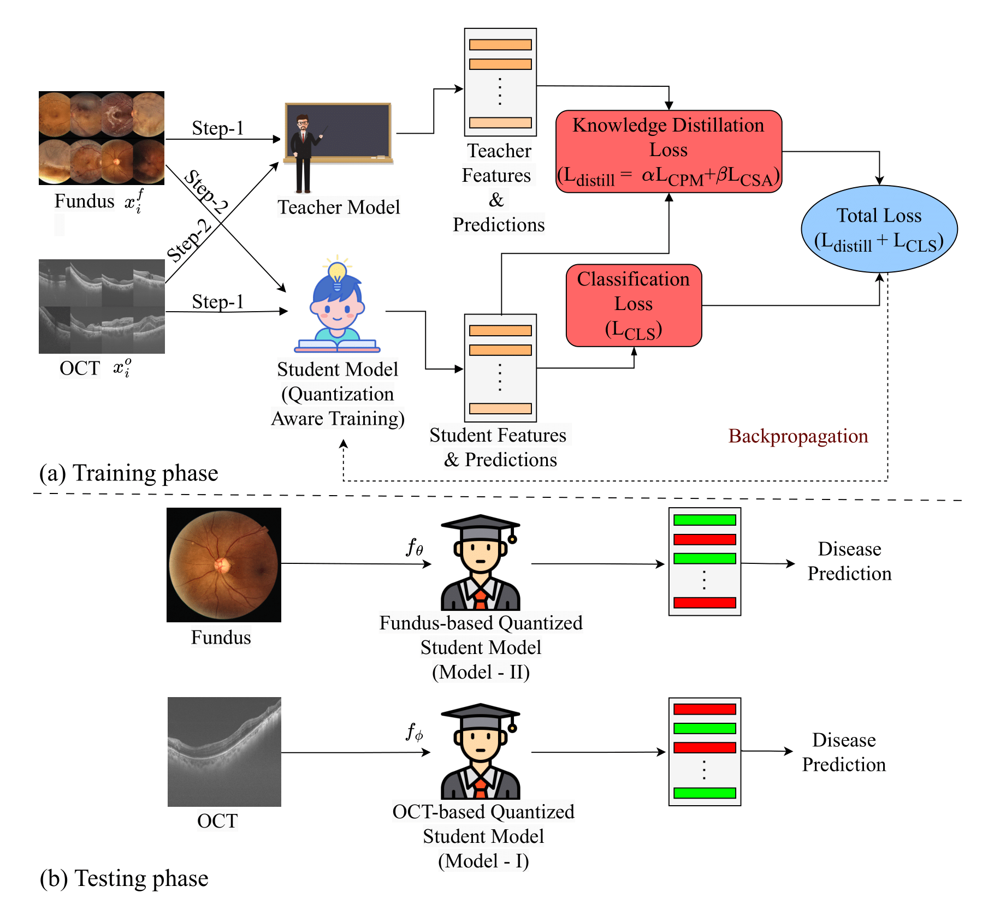

# QD-RetNet: Efficient Retinal Disease Classification via Quantized Knowledge Distillation

## Introduction

Retinal diseases can cause permanent vision loss if not diagnosed early, making efficient AI-based screening tools essential. However, most deep learning methods rely on heavy multi-modal inputs and large models, limiting their practicality. QD-RetNet addresses this by enabling lightweight, single-modality diagnosis through knowledge distillation and quantization-aware training. 
<br>  
This repository provides the **official PyTorch implementation** of our MIUA 2025 paper.



**Figure:** The proposed training pipeline consists of two steps. First, the fundus model teaches the quantized OCT model; second, the OCT model teaches the quantized fundus model. Only the quantized student model is used at inference, requiring just a single image modality (fundus or OCT).

---

## Update

📌 **[2025-05-12]** QD-RetNet has been accepted for publication at the **29th UK Conference on Medical Image Understanding and Analysis (MIUA 2025 – Leeds)**.

---

## Requirements

To set up the environment, run the following commands:

```bash
# Create a new conda environment with Python 3.10
conda create -n qd-retnet python==3.10

# Activate the environment
conda activate qd-retnet

# Install other dependencies
pip install -r requirements.txt

```

## Implementation

### DATA

Below are links to the original dataset repositories we used. Please follow their README instructions to download and organize the datasets:

- **TOPCON-MM Dataset**: [xmed-lab/FDDM](https://github.com/xmed-lab/FDDM/blob/main/README.md)  
- **MMC-AMD Dataset**: [li-xirong/mmc-amd](https://github.com/li-xirong/mmc-amd/blob/main/README.md)  
- **MultiEYE Dataset**: [xmed-lab/MultiEYE](https://github.com/xmed-lab/MultiEYE/blob/main/README.md)  

This repository provides full setup and dataloaders for the TOPCON-MM dataset. For other datasets, you will need to modify the dataloader and folder structure accordingly.

---

## Training Models

### Train Single-Modal Teacher Models:

```bash
python train_oct.py
python train_fundus.py
```

### Mutually train Quantized Student Models:

```bash
python main.py
```

### (Optional) Train Full-Precision FDDM and ODDM Models for comparison:

```bash
python train_fddm.py
python train_oddm.py
```

## Acknowledgements

- We acknowledge the public availability of the datasets we used: [FDDM](https://github.com/xmed-lab/FDDM),  [MMC-AMD](https://github.com/li-xirong/mmc-amd),  [MultiEYE](https://github.com/xmed-lab/MultiEYE)

- The knowledge distillation implementation is adapted from:
   https://github.com/xmed-lab/FDDM

- This research is supported by IIT (ISM) Dhanbad under the project FRS(220)/2024-2025/M&C.

## Contact

For questions or collaborations, please reach out to:
- 📧 **Ashutosh Kumar**: kumarashutosh9694@gmail.com
- 📧 **Manisha Verma**: manisha@iitism.ac.in
